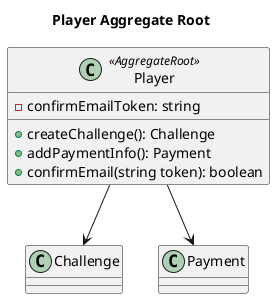
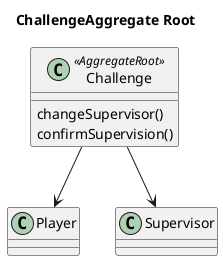

# Domain Driven Design

Desenvolver o software A PARTIR do domínio

- Entender como as Entidades interagem
- Que eventos acontecem
- Quais são as regras do domínio

## Ubiquitous Language

A Linguagem só é **onipresente** se todos os seus termos mantém
o mesmo significado em todos os lugares onde são utilizados.

O objetivo de desenvolver esse dialeto é facilitar a comunicação
entre os desenvolvedores, arquitetos e especialistas no domínio.

## Bounded Context

> No ATQR: Challenges (_poderia_ ter Payments)

Limita as partes do software em que um termo da Ubiquitous Language será utilizado garantindo que ele mantenha seu
significado em todo o contexto.

## Value Objects

"Objetos de **VALOR**" são usados para representar objetos do domínio
que são intercambiáveis se tiverem EXATAMENTE os mesmos valores de
propriedades.

Ou seja, esses objetos não tem identidade. Importa neles apenas o conjunto de valores dos seus atributos.

Value Objects comuns: Money, Coordinate, Address, etc

## Entity

Uma Entidade representa um ator do domínio, um agente capaz de promover
alterações no estado do domínio e que possui identidade.

## Aggregate

Um conjunto de entitades que trabalham juntas.

#### Examples

## Aggregate Root Entity

A Entidade responsável por coordenar todas as operações em um Aggregate.

Ex: **Player**
