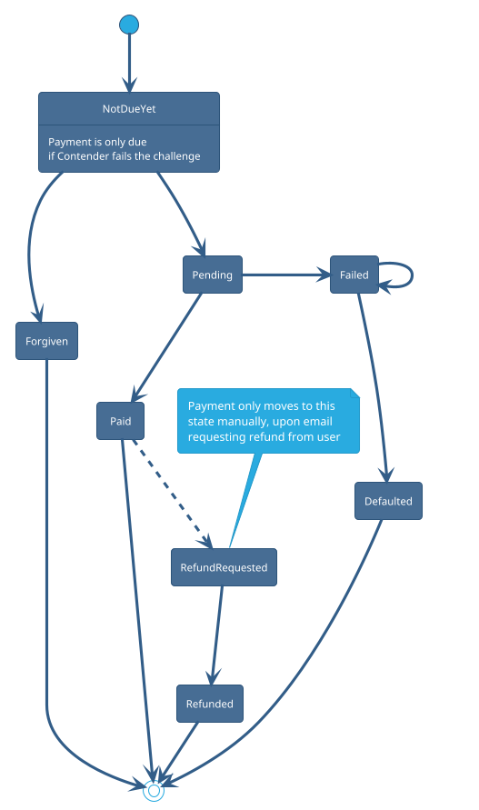

# Payment Flow

## Statuses

- NotDueYet
- Defaulted
- Failed
- Forgiven
- Paid
- Pending
- Refunded
- RefundRequested

## Status Flow

<!--
TODO: Check if we should use Settled state after Paid + 30 days -->

